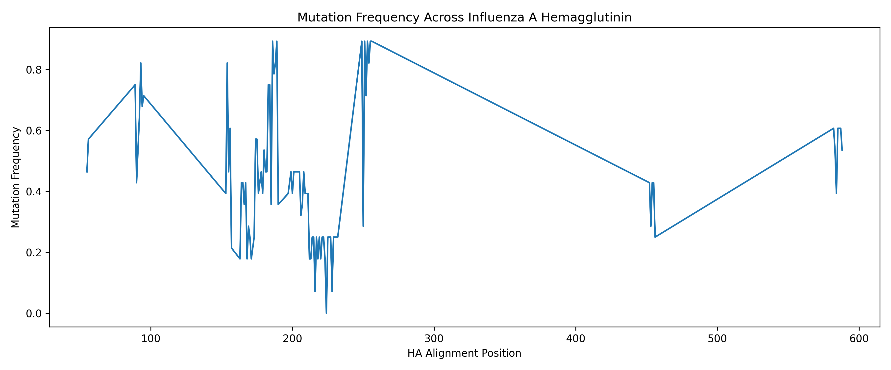

# Influenza A Hemagglutinin Mutation Analysis

**Author:** George Baldwin  

---

## Overview

Influenza A viruses evolve rapidly, making it difficult to predict outbreaks and design effective vaccines. While mutations are often considered random, increasing evidence suggests that host immune pressure influences where mutations occur within viral proteins.

This project analyzes mutation patterns in the **hemagglutinin (HA)** protein across Influenza A strains (H1N1), using sequence alignment and computational analysis to determine whether mutations are randomly distributed or clustered in specific regions.

---

## Research Question

Do mutations in Influenza A hemagglutinin occur randomly, or do they cluster in specific regions due to selective pressures?

---

## Hypothesis

Mutations in HA are **not evenly distributed**, but instead occur more frequently in certain regions of the protein, consistent with selective pressures such as immune system targeting.

---

## Methods

### Data Collection
- HA protein sequences (H1N1) were downloaded from the **NCBI Influenza Virus Database**
- Only **full-length sequences** were used

### Sequence Alignment
- Sequences were aligned using **MAFFT**
- Default parameters were used
- Output saved as aligned FASTA file

### Mutation Analysis
- Custom Python script calculated mutation frequency at each alignment position
- First sequence used as reference
- Mutation frequency = proportion of sequences differing at each position

### Visualization
- Mutation frequencies plotted using Python (`matplotlib`)
- Generated a continuous mutation profile across HA

---

## Results

- Mutation frequency varies significantly across HA
- Some regions show **high variability (~0.9)**
- Other regions remain **highly conserved (~0.0–0.2)**

### Key Insight
Mutations are **not uniformly distributed** — they cluster in specific regions of the protein.

This suggests:
- Some regions tolerate or favor mutation
- Other regions are structurally or functionally constrained

---

## Discussion

The clustering of mutations supports the idea that HA evolution is **non-random** and influenced by selective pressures.

- High mutation regions may correspond to:
  - Immune-exposed (antigenic) regions
  - Sites under antibody pressure

- Conserved regions likely represent:
  - Structurally important domains
  - Functionally critical residues

### Limitations
- Small number of sequences
- No direct mapping to antigenic regions (yet)

### Future Work
- Map mutation frequency to known antigenic sites
- Increase dataset size
- Perform statistical comparisons between regions

---

## Figure

**Figure 1.** Mutation frequency across Influenza A hemagglutinin (HA).  
Peaks represent highly variable regions, while troughs indicate conserved regions, demonstrating non-uniform mutation distribution.

---

## Repository Structure

influenza-ha-mutation-analysis/
│
├── data/
│ ├── raw/ # Original FASTA sequences
│ └── processed/ # Aligned sequences
│
├── scripts/ # Python analysis scripts
├── results/ # Mutation count outputs (CSV)
├── figures/ # Generated plots
├── notebooks/ # Optional exploratory work
│
├── README.md
├── requirements.txt

---

## Data & Code

GitHub Repository:  https://github.com/Xyromyth/influenza-ha-mutation-analysis

---

## References

- Petrovic, D., Dempsey, E., & Doherty, D. G. (2012).  
  *Hepatitis C virus—T-cell responses and viral escape mechanisms.*  
  Journal of General Virology, 93(12), 2690–2701.

- Nelson, M. I., & Holmes, E. C. (2007).  
  *The evolution of epidemic influenza.*  
  Nature Reviews Genetics, 8(3), 196–205.